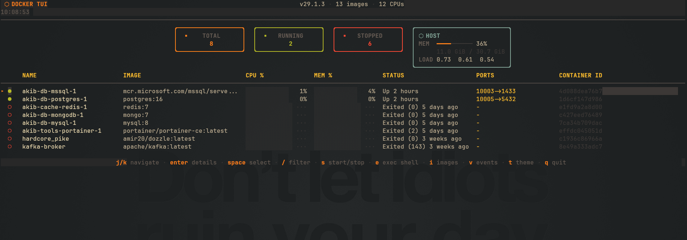

# docker-tui

A fast, keyboard-first terminal UI for Docker. Monitor containers, inspect details, manage images, and follow events in one place.




## Why docker-tui

- **Productive by default**: optimized for keyboard workflows and low-friction operations.
- **Operational visibility**: live container CPU/memory usage, host memory/load, and event stream.
- **Focused management**: inspect, start/stop/restart/remove containers, and manage images without context switching.

## Features

- Container list with live CPU/memory bars, filter, multi-select, and compose grouping
- Detail view with tabs for info, resources, environment, logs, and terminal
- Images view for listing, pulling, and removing images
- Real-time Docker events stream with action highlighting
- Host dashboard with system memory and load averages
- Persistent CPU/memory history (sparklines survive restarts)
- Responsive layout for narrow and wide terminals
- Mouse support (scroll and row selection)
- 10 built-in themes

## Installation

### Pre-built binary (recommended)

Download the latest release from [Releases](https://github.com/Akib558/docker-tui/releases).

### `go install`

```bash
go install github.com/akib/docker-tui@latest
```

### Build from source

```bash
git clone https://github.com/Akib558/docker-tui
cd docker-tui
make build          # creates ./docker-tui
make install        # installs to $GOPATH/bin
```

## Requirements

- Docker daemon running and accessible (local socket or `DOCKER_HOST`)
- Terminal with 256-color support
- Go 1.25+ (only for building from source)

## Quick start

```bash
docker-tui
```

Core workflow:
1. Navigate with `j/k` (or arrow keys).
2. Press `enter` to open container details.
3. Use `s`, `R`, `d`, `e` for actions.
4. Press `/` to filter, `i` for images, `v` for events, and `q` to quit.

## Key bindings

### List view

| Key | Action |
|-----|--------|
| `j` / `k` / `↑` / `↓` | Navigate |
| `enter` / `l` | Open container detail |
| `space` | Toggle multi-select |
| `a` | Select/deselect all |
| `s` | Start/stop selected container(s) |
| `R` | Restart selected container(s) |
| `d` | Remove selected container(s) |
| `e` | Open `docker exec -it` in a new terminal |
| `/` | Enter filter mode |
| `C` | Clear filter |
| `c` | Toggle compose grouping |
| `i` | Open images view |
| `v` | Open events view |
| `t` | Open theme picker |
| `+` / `-` | Adjust refresh interval |
| `r` | Force refresh |
| `q` | Quit |

### Detail view

| Key | Action |
|-----|--------|
| `tab` / `→` | Next tab |
| `shift+tab` / `←` | Previous tab |
| `j` / `k` | Scroll |
| `↑` / `↓` / `pgup` / `pgdn` | Scroll detail content (Terminal scrollback) |
| `l` | Toggle live logs (Logs tab) |
| `x` | Reconnect embedded shell (Terminal tab) |
| `ctrl+\` | Detach embedded shell |
| `s` | Start/stop container |
| `R` | Restart container |
| `d` | Remove container |
| `e` | Open `docker exec -it` in a new terminal |
| `t` | Open theme picker |
| `esc` | Back to list |

Terminal tab auto-follows newest output by default and pauses follow mode when you scroll up.

### Filter mode

| Key | Action |
|-----|--------|
| type | Search by name/image/state |
| `backspace` | Delete character |
| `ctrl+u` | Clear filter |
| `enter` / `esc` | Exit filter mode |

### Images view

| Key | Action |
|-----|--------|
| `j` / `k` | Navigate |
| `p` | Pull image (enter reference) |
| `d` | Remove image |
| `r` | Refresh |
| `esc` | Back |

## Configuration

Config file: `~/.config/docker-tui/config.json`

```json
{
  "theme": "dark-green",
  "refresh_seconds": 3,
  "alert_cpu": 80.0,
  "alert_mem": 80.0
}
```

| Field | Default | Description |
|-------|---------|-------------|
| `theme` | `"dark-green"` | Active theme |
| `refresh_seconds` | `3` | List refresh interval (1–30 sec) |
| `alert_cpu` | `80.0` | CPU alert threshold (%) |
| `alert_mem` | `80.0` | Memory alert threshold (%) |

History cache: `~/.cache/docker-tui/history.json`

## Themes

`dark-green`, `dracula`, `nord`, `gruvbox`, `tokyo-night`, `catppuccin-mocha`, `catppuccin-latte`, `rose-pine`, `ayu-dark`, `monokai`

Switch themes at runtime with `t` -> `j/k` -> `enter`.

## Contributing

Contributions are welcome. Please read [CONTRIBUTING.md](CONTRIBUTING.md) before opening a pull request.

## Security

For responsible disclosure, see [SECURITY.md](SECURITY.md).

## License

Licensed under the [MIT License](LICENSE).
