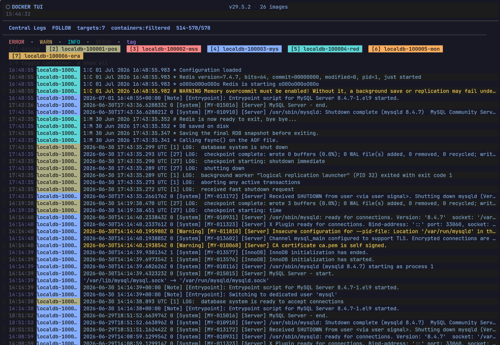
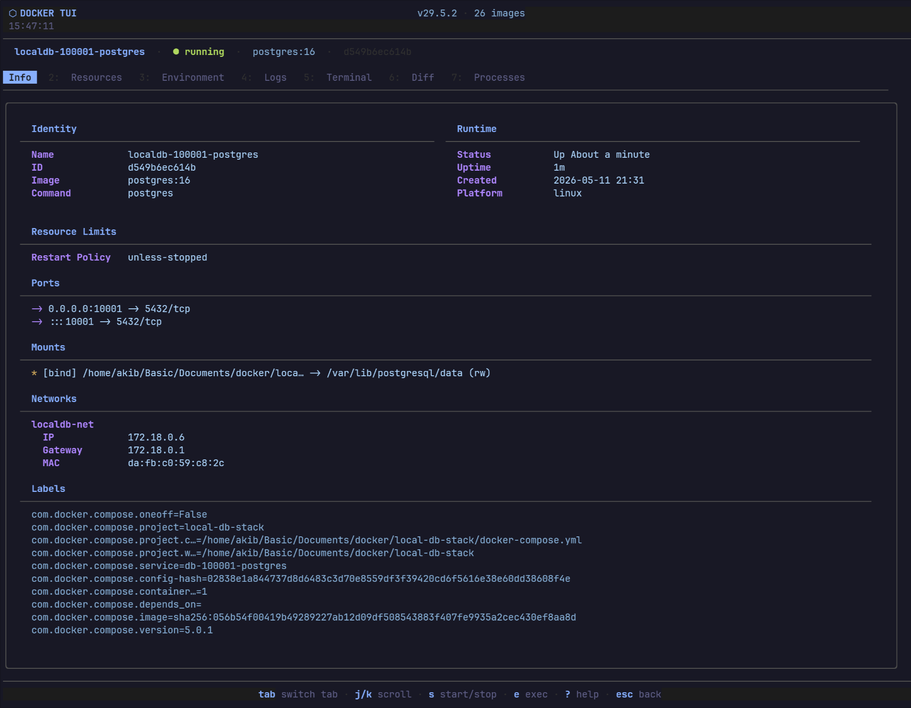

<div align="center">

# ⬡ docker-tui

### Your Docker host, on one screen.

A fast, keyboard-first terminal UI for Docker. Monitor, inspect, log, and control
containers, images, volumes, and networks — without juggling long `docker` commands.

[](https://github.com/Akib558/docker-tui/actions/workflows/ci.yml)


[](https://github.com/Akib558/docker-tui/stargazers)


</div>

---

## ⚡ Install in one line

> Prebuilt static binaries — no Go, no dependencies. Just a running Docker daemon.

**🐧 Linux · 🍎 macOS**

```bash
curl -fsSL https://raw.githubusercontent.com/Akib558/docker-tui/main/scripts/install.sh | sh
```

**🪟 Windows (PowerShell)**

```powershell
irm https://raw.githubusercontent.com/Akib558/docker-tui/main/scripts/install.ps1 | iex
```

**🐹 With Go**

```bash
go install github.com/Akib558/docker-tui@latest
```

Then just run:

```bash
docker-tui
```

<sub>The one-line installers pull the latest release from GitHub. See [Installation](#installation) for manual downloads and building from source.</sub>

---

## Why docker-tui

Docker's CLI is powerful, but day-to-day container work means repeating the same status
checks, log tails, restarts, and inspects. docker-tui folds all of that into one responsive,
keyboard-driven screen that feels right at home over SSH.

| Instead of… | With docker-tui |
| --- | --- |
| `docker ps` + `docker stats` in two panes | One live dashboard with CPU/MEM bars and sparklines |
| A `docker logs -f` window per service | One merged, color-tagged, filterable log stream |
| Scrolling walls of `docker inspect` JSON | Seven labelled, navigable detail tabs |
| A shell loop to restart a group | Multi-select and one keypress |
| Remembering `prune` flags per resource | Guided prune with a confirmation step |

**Reach for it when you want to:**

- See container status, ports, CPU, memory, and Docker host health at a glance.
- Jump from a container list into details, logs, environment, resource history, or a shell.
- Follow logs from one or many containers with stable color labels and filtering.
- Start, stop, restart, kill, pause, and remove containers without leaving the keyboard.
- Manage images, volumes, and networks alongside containers in the same interface.
- Keep a single lightweight binary that works great in terminal-first and SSH workflows.

## Features

### 🖥️ Live container dashboard

- Container list ordered running-first, then by name — active workloads stay on top.
- Live **status strip**: running / paused / stopped / created counts, plus last-refresh age.
- Inline **CPU % and MEM % bars** per container, color-graded green → amber → red.
- Host memory and load overview (Linux).
- Persistent **CPU/MEM sparklines** cached to disk, so short restarts don't erase context.
- Container **uptime**, **restart-count**, and **health-check** status.
- **Responsive columns** — NAME/STATUS on narrow terminals; IMAGE, CPU, MEM, PORTS, ID, and I/O added as the window widens.
- Adjustable refresh interval, manual refresh, and sort cycling (name → state → CPU → memory → image).

### 📜 Logs built for real work

- Per-container **Logs tab** in the detail view.
- **Centralized logs** across selected containers, or all running containers when nothing is selected.
- Stable **per-container color tags** so interleaved streams stay readable.
- **Severity coloring** out of the box (ERROR / WARN / INFO / DEBUG) plus configurable highlight patterns.
- Timestamp-aware ordering, text/**regex** filtering, and **follow mode** that pauses when you scroll up.
- **Copy** a line (`y`) or **export** the whole buffer to a file (`E`).

### 🔍 Deep container inspection

Seven tabs per container — no more piping `docker inspect` through `jq`:

- **Info** — identity, runtime, resource limits, ports, mounts, networks, and compose labels.
- **Resources** — CPU/memory history graphs.
- **Environment** — environment variables.
- **Logs** — the focused per-container log view.
- **Terminal** — an embedded shell session, in-app.
- **Diff** — filesystem changes on the container's writable layer.
- **Processes** — running processes inside the container (`docker top`).

### ⚡ Operational controls

- Start, stop, restart, kill, and pause/unpause — one container or a multi-selected group.
- Remove containers, or run `docker system prune` with a confirmation step.
- Open an external `docker exec -it` session, or use the embedded terminal tab.
- **Command palette** (`:`) for fuzzy access to any action by name.

### 📦 Full Docker inventory

- **Images** — list, pull, remove, and prune dangling images.
- **Volumes** — list, remove, prune orphaned volumes, filter, and multi-select.
- **Networks** — list, remove, filter, and multi-select.

### 🔔 Notifications & 🎨 ergonomics

- Persistent **notification center** (`N`) for every action result and connection event.
- **CPU/memory threshold alerts**.
- **Ten built-in themes**, switchable at runtime (`t`).
- Keyboard-first navigation with mouse support; responsive layout for any terminal size.
- JSON config for refresh interval, alert thresholds, theme, and stable log colors.

## Screenshots

**Centralized logs — merge, color-tag, filter, and follow many containers at once**



**Detail view — seven tabs of everything `docker inspect` knows**



## Installation

### One-line installers (recommended)

See [Install in one line](#-install-in-one-line) above. The scripts detect your OS and
architecture, download the matching release archive, and drop the binary onto your PATH
(`~/.local/bin` on Linux/macOS, `%LOCALAPPDATA%\docker-tui\bin` on Windows).

### Pre-built binaries

Download an archive for your platform from [GitHub Releases](https://github.com/Akib558/docker-tui/releases)
(Linux, macOS, and Windows for amd64 and arm64), extract it, and place the `docker-tui`
binary somewhere on your `PATH`.

### Go install

```bash
go install github.com/Akib558/docker-tui@latest
```

### Build from source

```bash
git clone https://github.com/Akib558/docker-tui.git
cd docker-tui
make build
./docker-tui
```

Install the locally built binary into your Go bin directory:

```bash
make install
```

## Requirements

- Docker daemon running and reachable through the local socket or `DOCKER_HOST`.
- Terminal with 256-color support.
- Go 1.25 or newer when building from source.

Host memory and load metrics are Linux-specific. Core Docker workflows work on all supported
platforms whenever Docker is reachable.

## Quick start

```bash
docker-tui
```

1. Move through containers with `j` / `k` or arrow keys.
2. Press `enter` to inspect the selected container.
3. Use `tab` to move through detail tabs.
4. Press `L` from the list to open centralized logs.
5. Press `/` to filter containers or logs.
6. Press `s`, `R`, or `d` to start/stop, restart, or remove containers.
7. Press `:` to open the command palette, or `?` for the full keyboard reference.
8. Press `q` to quit.

## Key bindings

### Common

| Key | Action |
| --- | --- |
| `ctrl+c` | Quit immediately |
| `q` | Quit from list or detail; return from other views |
| `esc` | Back, cancel, or exit the current mode |
| `?` | Show full keyboard reference |
| `:` | Open command palette |

### Container list

| Key | Action |
| --- | --- |
| `j` / `k`, arrows | Move selection |
| `g` / `home` | Jump to first container |
| `G` / `end` | Jump to last container |
| `enter` / `l` | Open container details |
| `space` | Toggle container selection |
| `a` | Select or deselect all visible containers |
| `/` | Filter by name, image, or state |
| `C` | Clear filter |
| `c` | Toggle compose grouping |
| `S` | Cycle sort mode (name → state → CPU → memory → image) |
| `s` | Start or stop selected container(s) |
| `R` | Restart selected container(s) |
| `P` | Pause or unpause selected container(s) |
| `K` | Kill selected container(s) |
| `X` | Run `docker system prune` after confirmation |
| `d` | Remove selected container(s) after confirmation |
| `e` | Open external `docker exec -it` shell |
| `L` | Open centralized logs |
| `i` | Open images view |
| `v` | Open volumes view |
| `n` | Open networks view |
| `N` | Open notification center |
| `+` / `-` | Increase or decrease refresh interval |
| `r` | Force refresh |
| `t` | Open theme picker |

### Detail view

| Key | Action |
| --- | --- |
| `tab` / `right` | Next tab |
| `shift+tab` / `left` | Previous tab |
| `1`–`7` | Jump to Info / Resources / Environment / Logs / Terminal / Diff / Processes |
| `f` | Fetch filesystem changes (Diff tab) |
| `p` | Fetch process list (Processes tab) |
| `j` / `k`, arrows | Scroll content |
| `pgup` / `pgdn` | Page through content |
| `home` / `end` | Jump to top or bottom; `end` resumes follow mode |
| `l` | Toggle live log streaming (Logs tab) |
| `E` | Export log buffer to file (Logs tab) |
| `x` | Reconnect embedded shell (Terminal tab) |
| `ctrl+\` | Detach embedded shell |
| `s` / `R` / `P` / `K` | Start-stop / restart / pause / kill container |
| `d` | Remove container after confirmation |
| `e` | Open external `docker exec -it` shell |
| `esc` | Return to the container list |

### Centralized logs

| Key | Action |
| --- | --- |
| `j` / `k`, arrows | Scroll log window |
| `pgup` / `pgdn` | Page through logs |
| `home` / `end` | Jump to oldest or newest; `end` resumes follow mode |
| `y` | Copy selected log line to clipboard |
| `E` | Export full log buffer to file |
| `/` | Filter by container name or log message |
| `r` | Toggle regex mode (while filtering) |
| `ctrl+u` | Clear active log filter |
| `esc` | Exit filter mode or return to the list |

### Images

| Key | Action |
| --- | --- |
| `j` / `k`, arrows | Move selection |
| `p` | Pull image by reference |
| `P` | Prune dangling images after confirmation |
| `d` | Remove selected image |
| `r` | Refresh image list |
| `esc` / `q` | Return to the container list |

### Volumes

| Key | Action |
| --- | --- |
| `j` / `k`, arrows | Move selection |
| `space` | Toggle volume selection |
| `a` | Select or deselect all volumes |
| `d` | Remove selected volume(s) after confirmation |
| `p` | Prune all orphaned volumes after confirmation |
| `/` | Filter by name or driver |
| `ctrl+u` | Clear filter |
| `r` | Refresh volume list |
| `esc` / `q` | Return to the container list |

### Networks

| Key | Action |
| --- | --- |
| `j` / `k`, arrows | Move selection |
| `space` | Toggle network selection |
| `a` | Select or deselect all networks |
| `d` | Remove selected network(s) after confirmation |
| `/` | Filter by name |
| `ctrl+u` | Clear filter |
| `r` | Refresh network list |
| `esc` / `q` | Return to the container list |

### Notification center

| Key | Action |
| --- | --- |
| `j` / `k`, arrows | Navigate notifications |
| `g` / `G` | Jump to oldest / newest |
| `c` | Clear all notifications |
| `esc` / `q` | Return to the container list |

## Configuration

Config file: `~/.config/docker-tui/config.json`

```json
{
  "theme": "dark-green",
  "refresh_seconds": 3,
  "alert_cpu": 80.0,
  "alert_mem": 80.0,
  "container_colors": {
    "api": "#00E676",
    "worker": "#7AA2F7"
  }
}
```

| Field | Default | Description |
| --- | --- | --- |
| `theme` | `"dark-green"` | Active color theme |
| `refresh_seconds` | `3` | List refresh interval, clamped between 1 and 30 seconds |
| `alert_cpu` | `80.0` | CPU alert threshold as a percentage |
| `alert_mem` | `80.0` | Memory alert threshold as a percentage |
| `container_colors` | `{}` | Stable color overrides by exact container ID, exact name, or ID prefix |

Runtime history cache: `~/.cache/docker-tui/history.json`

## Themes

```text
dark-green, dracula, nord, gruvbox, tokyo-night,
catppuccin-mocha, catppuccin-latte, rose-pine, ayu-dark, monokai
```

Switch themes inside the app with `t`, select with `j` / `k`, then press `enter`.

## Development

```bash
make build        # build ./docker-tui
make run          # run from source
make test         # run unit tests
make lint         # run golangci-lint
make coverage     # write coverage.out and coverage.html
```

Project layout:

```text
config/    Theme definitions and JSON config persistence
docker/    Docker SDK wrapper: containers, images, volumes, networks, events, logs, stats, host metrics
ui/        Bubble Tea model, commands, views, rendering core, themes, dialogs, and helpers
scripts/   Cross-platform install scripts
```

The CI pipeline runs `go vet`, race-enabled tests, cross-platform builds, and golangci-lint.

## Contributing

Contributions are welcome. Keep pull requests focused, include tests for new behavior, and
run the local checks before submitting. See [CONTRIBUTING.md](CONTRIBUTING.md).

## Security

Please do not open public issues for vulnerabilities. Follow [SECURITY.md](SECURITY.md) for
responsible disclosure.

## License

Licensed under the [MIT License](LICENSE). Built with
[Bubble Tea](https://github.com/charmbracelet/bubbletea) and
[Lip Gloss](https://github.com/charmbracelet/lipgloss).

<sub>Not affiliated with Docker, Inc.</sub>
