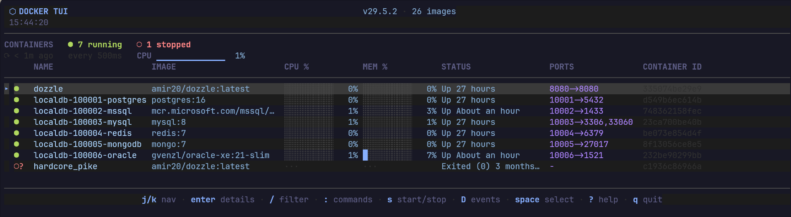

# docker-tui

A fast, keyboard-first terminal UI for Docker. Use one terminal screen to monitor containers, inspect runtime details, follow logs, manage images, and react to Docker events without bouncing between long `docker` commands.




## Why docker-tui

Docker's CLI is powerful, but day-to-day container work often means repeating the same status checks, log tails, restarts, and inspect commands. docker-tui keeps those workflows in one responsive terminal interface.

Use it when you want to:

- See container status, ports, CPU, memory, and Docker host health at a glance.
- Jump from a container list into details, logs, environment, resource history, or a shell.
- Follow logs from one container or many containers with stable labels and filtering.
- Start, stop, restart, remove, pull, and inspect without leaving the keyboard.
- Keep a lightweight tool that works over SSH and inside terminal-first workflows.

## Highlights

### Live Container Dashboard

- Container list with state, image, ports, IDs, CPU, memory, and compose grouping.
- Host memory and load overview on Linux.
- Persistent CPU and memory sparklines so short restarts do not erase context.
- Adjustable refresh interval and manual refresh.

### Operational Controls

- Start, stop, restart, and remove one container or a multi-selected group.
- Open an external `docker exec -it` session from the list or detail view.
- Use the embedded terminal tab for an in-app shell session when available.
- Confirm destructive operations before they run.

### Logs Built For Real Work

- Detail log tab for the current container.
- Centralized logs view for selected containers, or all running containers when nothing is selected.
- Timestamp-aware log ordering with deterministic fallback ordering.
- Filter logs by container name or message.
- Follow mode that pauses when you scroll up and resumes at the bottom.

### Docker Inventory

- Images view for listing, pulling, and removing images.
- Real-time Docker events stream with highlighted event actions.
- Detail tabs for container info, resources, environment, logs, and terminal.

### Terminal Ergonomics

- Keyboard-first navigation with mouse support for row selection and scrolling.
- Responsive layout for narrow and wide terminals.
- Ten built-in themes, switchable at runtime.
- JSON config for refresh interval, alert thresholds, theme, and stable log colors.

## Installation

### Pre-built Binaries

Download a release archive from [GitHub Releases](https://github.com/akib558/docker-tui/releases), then place the `docker-tui` binary somewhere on your `PATH`.

### Go Install

```bash
go install github.com/akib558/docker-tui@latest
```

### Build From Source

```bash
git clone https://github.com/akib558/docker-tui.git
cd docker-tui
make build
./docker-tui
```

To install the locally built command into your Go binary directory:

```bash
make install
```

## Requirements

- Docker daemon running and accessible through the local socket or `DOCKER_HOST`.
- Terminal with 256-color support.
- Go 1.25 or newer when building from source.

Host memory and load metrics are Linux-specific. Core Docker workflows still work on other supported build targets when Docker is reachable.

## Quick Start

```bash
docker-tui
```

Common workflow:

1. Move through containers with `j` / `k` or arrow keys.
2. Press `enter` to inspect the selected container.
3. Use `tab` to move through detail tabs.
4. Press `L` from the list to open centralized logs.
5. Press `/` to filter containers or logs.
6. Press `s`, `R`, or `d` to start/stop, restart, or remove containers.
7. Press `q` to quit.

## Key Bindings

### Common

| Key | Action |
| --- | --- |
| `ctrl+c` | Quit immediately |
| `q` | Quit from list, detail, or centralized logs; return from images or events |
| `esc` | Back, cancel, or exit the current mode |

### Container List

| Key | Action |
| --- | --- |
| `j` / `k`, arrows | Move selection |
| `enter` / `l` | Open container details |
| `space` | Toggle container selection |
| `a` | Select or deselect all visible containers |
| `/` | Filter by name, image, or state |
| `C` | Clear filter |
| `c` | Toggle compose grouping |
| `s` | Start or stop selected container(s) |
| `R` | Restart selected container(s) |
| `d` | Remove selected container(s) after confirmation |
| `e` | Open external `docker exec -it` shell |
| `L` | Open centralized logs |
| `i` | Open images view |
| `v` | Open events view |
| `+` / `-` | Increase or decrease refresh interval |
| `r` | Force refresh |
| `t` | Open theme picker |

### Detail View

| Key | Action |
| --- | --- |
| `tab` / `right` | Next tab |
| `shift+tab` / `left` | Previous tab |
| `j` / `k`, arrows | Scroll log or terminal content |
| `pgup` / `pgdn` | Page through log or terminal content |
| `home` / `end` | Jump to top or bottom; `end` resumes follow mode |
| `l` | Toggle live logs on the Logs tab |
| `x` | Reconnect embedded shell on the Terminal tab |
| `ctrl+\` | Detach embedded shell |
| `s` | Start or stop container |
| `R` | Restart container |
| `d` | Remove container after confirmation |
| `e` | Open external `docker exec -it` shell |
| `t` | Open theme picker |
| `esc` | Return to the container list |

### Centralized Logs

| Key | Action |
| --- | --- |
| `j` / `k`, arrows | Scroll log window |
| `pgup` / `pgdn` | Page through logs |
| `home` / `end` | Jump to oldest or newest logs; `end` resumes follow mode |
| `/` | Filter by container name or log message |
| `ctrl+u` | Clear active log filter |
| `esc` | Exit filter mode or return to the list |

### Images and Events

| View | Key | Action |
| --- | --- | --- |
| Images | `p` | Pull image by reference |
| Images | `d` | Remove selected image |
| Images | `r` | Refresh images |
| Images | `t` | Open theme picker |
| Images | `esc` | Return to the list |
| Events | `c` | Clear current event list |
| Events | `esc` | Return to the list |

## Configuration

Config file:

```text
~/.config/docker-tui/config.json
```

Example:

```json
{
  "theme": "dark-green",
  "refresh_seconds": 3,
  "alert_cpu": 80.0,
  "alert_mem": 80.0,
  "container_colors": {
    "api": "#00E676",
    "worker": "#7AA2F7"
  }
}
```

| Field | Default | Description |
| --- | --- | --- |
| `theme` | `"dark-green"` | Active color theme |
| `refresh_seconds` | `3` | List refresh interval, clamped between 1 and 30 seconds |
| `alert_cpu` | `80.0` | CPU alert threshold as a percentage |
| `alert_mem` | `80.0` | Memory alert threshold as a percentage |
| `container_colors` | `{}` | Stable color overrides by exact container ID, exact name, or ID prefix |

Runtime history cache:

```text
~/.cache/docker-tui/history.json
```

## Themes

Built-in themes:

```text
dark-green, dracula, nord, gruvbox, tokyo-night,
catppuccin-mocha, catppuccin-latte, rose-pine, ayu-dark, monokai
```

Switch themes inside the app with `t`, select with `j` / `k`, then press `enter`.

## Development

```bash
make build        # build ./docker-tui
make run          # run from source
make test         # run unit tests
make lint         # run golangci-lint
make coverage     # write coverage.out and coverage.html
```

Project layout:

```text
config/    Theme definitions and JSON config persistence
docker/    Docker SDK wrapper, images, events, logs, stats, and host metrics
ui/        Bubble Tea model, commands, views, themes, dialogs, and helpers
```

The CI pipeline runs `go vet`, race-enabled tests, cross-platform builds, and golangci-lint.

## Contributing

Contributions are welcome. Keep pull requests focused, include tests for new behavior, and run the local checks before submitting.

Read [CONTRIBUTING.md](CONTRIBUTING.md) for setup and project structure.

## Security

Please do not open public issues for vulnerabilities. Follow [SECURITY.md](SECURITY.md) for responsible disclosure.

## Changelog

See [CHANGELOG.md](CHANGELOG.md) for notable changes.

## Code of Conduct

This project follows [CODE_OF_CONDUCT.md](CODE_OF_CONDUCT.md).

## License

Licensed under the [MIT License](LICENSE).
